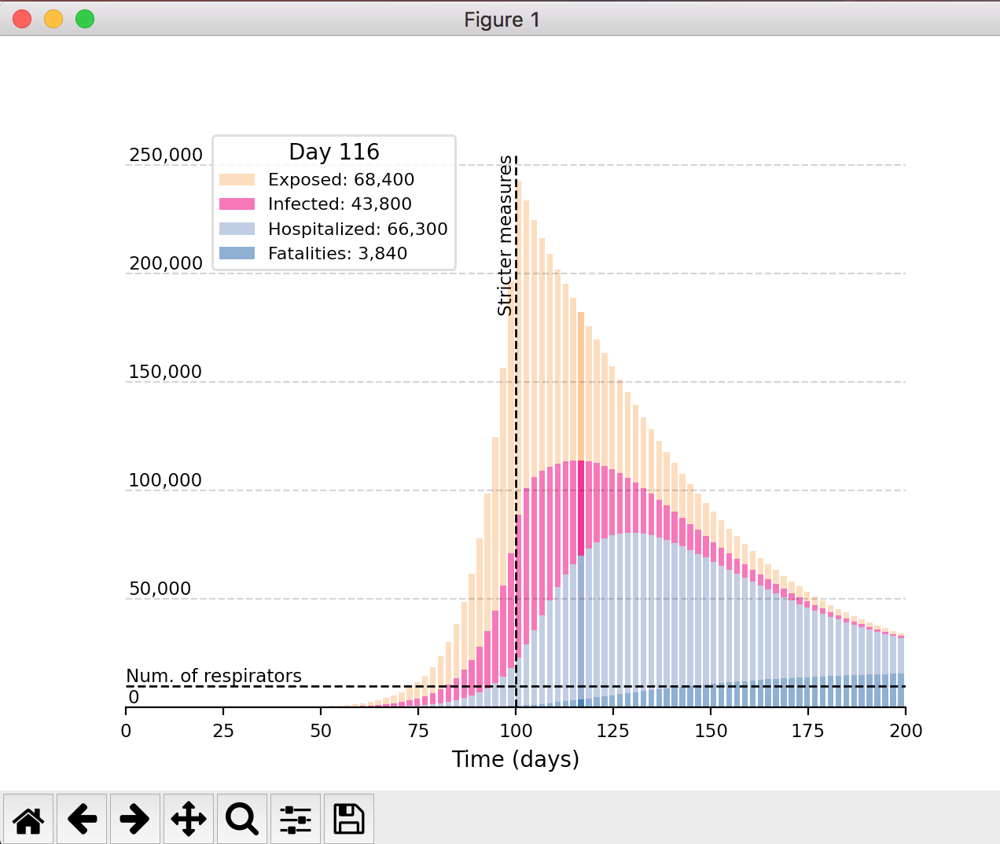

<!--Corona-->
<!------------>

This repo holds research on the Corona epidemic. 
<!--[Read the Docs](https://coronastudies.readthedocs.io/en/latest/)-->

Get started
================================================
Works on Linux/Windows/Mac.

1. **Prerequisite**: Python>=3.7.  
   If you're not an admin or expert:  
   1a. Install Python with [Anaconda](https://www.anaconda.com/download).  
   1b. Use the [Anaconda terminal](https://docs.conda.io/projects/conda/en/latest/user-guide/getting-started.html#starting-conda) to run the commands below.

2. **Install**:  
   Download and extract Corona,  
   Alternatively:  `$ git clone https://github.com/patricknraanes/Corona.git`  
   `$ cd` into the resulting folder
	 *(ensure you're in the folder with a `setup.py` file)*:  
   `$ pip install -e .` (don't forget the `.`).

3. **Test** by running: `$ ipython`  
   Then `In [1]: run src/corona/epcalc.py`  
   You should get output like this:
   

If the installation fails, you probably need to [create & activate a new Python environment](https://docs.conda.io/projects/conda/en/latest/user-guide/getting-started.html#managing-environments).

